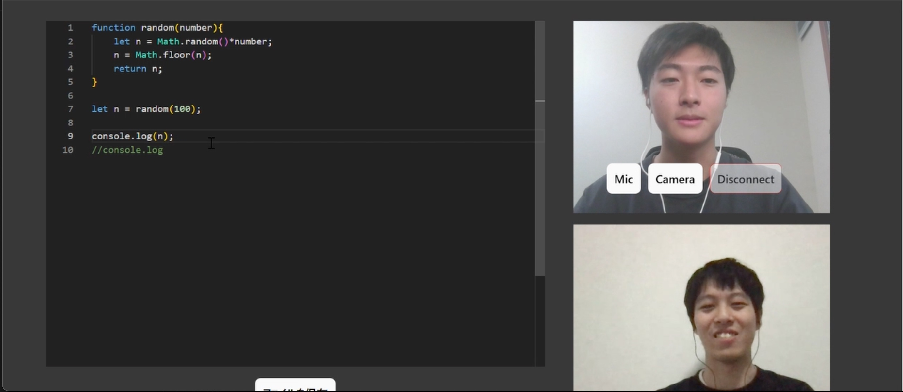

# LiCC(Live Coding Collaboration)

## 製品概要
### 背景(製品開発のきっかけ、課題等）

学校の課題などで一人で詰まったとき，友人に相談することがあると思います．
しかし，文面で修正箇所を伝え，作業するのはなかなか大変です．
そこで，通話を行うことになると思いますが，そのために別アプリを使うのは不便です．
このような問題を解決し、通話を通じたプログラミングの共同作業をより快適ににすることが目標です．
そして、小人数での開発やプログラミング学習の補助を支援し、プログラミングに対する敷居を低くしていきます．

### 製品説明（具体的な製品の説明）
通話を行いながら、ユーザーが共有しているコードを同時編集できるWebアプリケーション。
ラインやzoomのようなビデオ通話を行いながら同一のアプリで、
Microsoft OfficeやGoogle Driveのような共同編集を実現する。

利用方法は以下の手順
1. ホストとなるユーザーが通話ルームを作成
2. ともに通話するユーザーがそこに参加
3. ユーザーの一人がファイルをアップロード
4. 通話しながら共同編集
5. ユーザーがそれぞれ編集したファイルをダウンロード可能

### 特長
#### 1. ビデオ通話が可能

- Agoraというフレームワークを用いることにより、Zoomやライン通話のようなビデオを使った通話が可能

#### 2. 遠隔地からリアルタイムで共同編集ができる

- yjsという共同編集フレームワークとWebsocketを用いた通信により、リアルタイムな編集を実現

#### 3. 操作が直感的

- 同一のファイルを操作するという形式のため、直感的に変更を加えることが可能

### 類似製品との相違点

#### code together

- リアルタイムで同時編集が可能
- 通話はできない

#### live share

- VSCode上の拡張機能
- コードの同時編集が可能
- 通話機能はない(昔音声通は機能があったようだが、今は非対応)

#### code with me

- リアルタイムで同時編集が可能
- 通話も可能
- Webブラウザではなく専用のエディタを使用

### 解決出来ること
オンラインで同一のファイルを共同作業で編集するといった形をとることで、
コードに直接書く形でのコミュニケーションが可能になり、
修正の指摘や、提案などがスムーズになる。
また、ビデオ通話で相手の顔が見えることによって、表情や身振り手振りによる高度なコミュニケーションをとることができる。それにより、友人同士や初学者同士のプログラミング体験をより良いものにできる。

### 今後の展望
* ファイルのアップロード
* データベースでの管理
* 実行環境
* 画面共有
* コードの自動生成，修正

### 注力したこと（こだわり等）
- リアルタイム性を重視
  - リアルタイムな通話
  - リアルタイムな編集

## 開発技術
### 活用した技術
#### フレームワーク・ライブラリ・モジュール
* React
* Agola
* WebSocket
* monaco editor
* yjs
